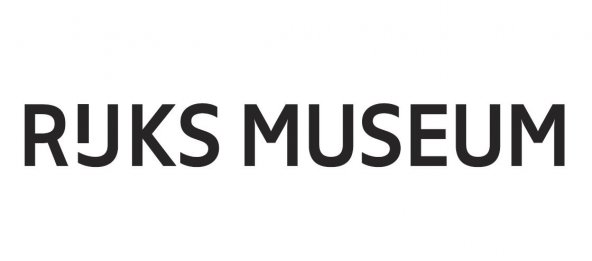

## Briefing
Voor deze opdacht was het de bedoeling dat we een een design voor een app maakten. De app dient om een museumbezoek aangenamer en functioneler te maken, het moest dus een toegevoegde waarde zijn. Het museum wat we wouden "upgraden" mochten we zelf kiezen. 

Bij deze app moest een bijhorende smartwatch app gemaakt worden, deze is enkel en alleen bedoeld als ondersteuning van de smarthone app.

## Gekozen Museum

Wij kozen dit museum, niet alleen omdat we er beiden enorme fan van zijn, maar ook omdat we het als een goede uitdaging zagen. Toen we binnenkwamen stelden we ons onmiddellijk de vraag "Wat gaan we hiermee doen?". Na enkele uren rond te wandelen kwamen we tot dezelfde conclusie: te veel kunstwerken, te weinig tijd.